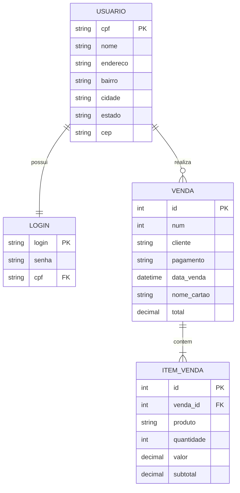

# Modelo Conceitual do Banco de Dados — Salgadê

## Entidades

- **USUARIO** — cliente cadastrado na loja
- **LOGIN** — credenciais de acesso do usuário
- **VENDA** — uma compra realizada
- **ITEM_VENDA** — cada produto que faz parte de uma venda

## Relacionamentos

- Um **usuário** possui **um login** (1:1)
- Um **usuário** pode realizar **várias vendas** (1:N)
- Uma **venda** contém **vários itens** (1:N)
